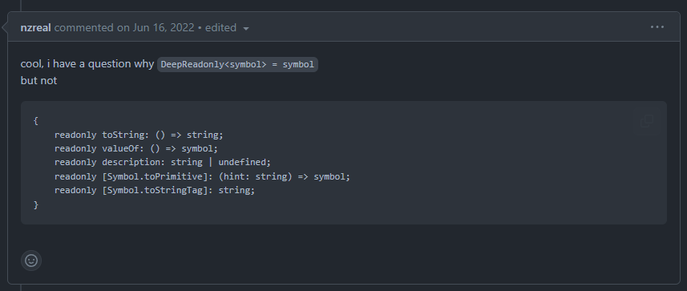
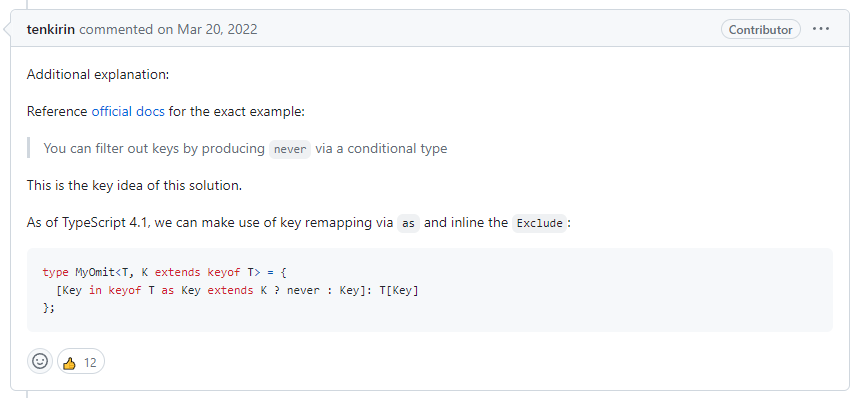

# 语法
#### 条件语句
```ts
T extends D ? true : false
```

[第一个元素](https://www.typescriptlang.org/play#code/PQKgUABBCMAsEFoKBpvQAHKCo5QwoqAJfSiEGF4BGAnhAIIB2ALgBYD2V5AYgK4QAUAAgIa0AzNgEoIAYkAB3oFVlcbwBOc3qTB4xaiIAyMwHduKqIDztQA3OGAAYsAlnIDONADwAVAHzHA2zaBo9UAw-4GDtQKXGgdeUMgA6mgCN+xnbGgG56gCvxgHtqnoAhbmhY2HGA3j6ugEAMuhCA0fKAQZqAWP9ZxsU0lng0pAAOAKYQ8nLQEAC8EADaAOS87QA0EO3EPX0Axu0AuuVVtfUATM1tAMy9073Q4xM1EHTVvAAmjS3mVrb10A4QwMAQgCl6gBXGgD-agF+KfV3rtVu7swcW1jYzZxfXe5PeZ4YrGLJnQAU6hAAOJmehsYgQQBQcoBT80A0O75Og0GiVSwALgupSGdAAdAArSykhhyADmwDgwAAXnQEABhAByYBAwBUoAgAH0hcKRcKIIADeTigGO5QCAHoLRQqBRAeSoKhtDj87BBqgAPGjVKg7Sx1ZitUZnFr8ZRgfmKhUQQDStoBV6MAFK7ZeV2sUqswAW0qNJoEDVtQA3hAAKIARzYvAANr1wzqakNAwBfCACOQMH19bjBhAkuOxg206qWYBsGhmWOWdqqyYQIa8SxluatPCJ5O2KMx2M2DW2VqLCDLGDm3rzBwObodpPVFM2Htx-vfQecURNM7QabDsO8fEQaxyMxUWkQVPjrgbrc7qczqCd+fd6PLgc2M3TiBUaoAN2qcjvWcu0XF8+zfVo2ENaoBBPaodkvSCdmg2CdkAtZg21BQaWNFp2ygAE80sBBdS7YisLkPA33aKgGBoCgFCUdppzwAjSmIucUzIrMKKgN8wwABgPToGNIAAZMwAGtqnac9mLWW1PTFQBoOVQQBTaw9RTlV5UA8DOQAwJUAarlJUAY8jABVvLEcTxQlgGJMlKWpOkGVgYB+EsAB3f9mVZTldIgDEzIs3ECSJSwSQpKkaXpRlLAYWNKzMJgyigM5ABezQAsTW0QKrJCsL7Mirz2S5FUgA)

<!-- 这里可以介绍一下 extends 的实践 以及 返回值未never的时候为什么能够过滤掉  让大家感受一下ts类型编程跟平常不一样的地方 -->
```ts
//answer1
type First<T extends any[]> = T extends [] ? never : T[0]

//answer2
type First<T extends any[]> = T['length'] extends 0 ? never : T[0]

//answer3
type First<T extends any[]> = T extends [infer A, ...infer rest] ? A : never
```

可以使用infer进行类型推断
限制使用的场景
- 只能使用在extends上
- 只能在true的条件下使用

[Include 挑战](https://www.typescriptlang.org/play#code/PQKgUABBAcCc0QLQQJIDsDGAbArgEwFMBnSJRci0gIwE8I0cssIAKAAQGsa0CAzHDgEoIAYkAB3oFVlUQEMATrOk0wpEaoiAMjMB3bsqiAKdUDePoGj1QN8+gfb9AM4mA87UANzhABS0gG7SAyhlkBLAA4AXCIBC3CAADAEF5RQA6D0xcQiIgiEBO00BVm0AYf8BN+MAqOSNAUuNAdeVAEjlMwCHlQAdTVMAV+MA9tX8jQEDIwAk5QHozYJ9ZHAIExpag3mksIk7AIAYdCEBo+UAgzUAsf9GguZ8SKB8aLwIIDyIABQ8mOQBZAjQIAF5UGPxiAB4AbQByAGk5IluAGghbgFEiDzwNj1f3gB1aQAWxwOABtxc0jQPhh0luAF03rcACIeAD2twAfBBgMAIAQAB6rDA+Ah4CA+DEQKhrXr9QZBUhzZmkXG6CAAcQ8PgAFjgqBBAFBygFPzQDQ7lM+T4fF4iAAufELDB8iIAKyIEQxsgA5sA4NBgAAvPmIADCADkwCBgMpQBAAPpO50u50QQAG8v5AMdygEAPR2ugMOiA25TLVZnbAXIiXAAqhKJ5LQeCIEFkBGkeAxaCwdBhNGuyIgAFVcac83aQP7Ay6IIBpW0Aq9GAClcxlXq07g7aPCCvNq-GG1gBvCAfACOOH6bw+JIIZIgAF8ILxZBiQe82P3ECr+lhDjriMAcD4ds9Qys1hhpIMU6drqQp6SfJdR+OsJd0JG4jcHk9IV8fn9IWBMEIRRaFYXhJEUUeWRnmxN42g6bE4LvacySfMd+jfc5PzuaDnhRP9fm+QDQXBSEwLhNAEULNFMRxN4+gGAgkJeFCH3Ql8sI-K5rgARjeAAmN4AGY3gAVjeAA2N4AHZCxkuCqXaZjkKge8Z0fZ9MPfWIeP4iAhIgUSIAkiBpIgOS3gAFkUxjBhYtiNI47TsL0wSRMLATFIQlTWLU1DNIw18dKjG59MM4TC147zlIc-z2K04LXOja4BznQsh2keV3hCW551sxlfMctDEq43SUqoDEMR3GF3KM8SpNkws7OYhjCri4cAucpLuJSny6uM0zzMs2kqpqtACqYjr1JKoKytC64WoGhqzKatqpvg2LVM6hK5pCnDMuy25cvnDLU3TTNs1zI6TrnSb7O2mbAs4-aeKHNMMyzHMICynK8vSt5Dr+-L1oevydqc0rXpS3ioogAAfAz7qK+LIb25KwoRgyouR6auqhjHrgYJhCxwJM+GiClcce-H0d6m4ycIXhKbwQtiawanWMRCtWzbCBAGg5QAAOUAU2teerDswFAdkIEAMCVAGq5T1AGPIwAVbylGU5UVYBlVVDUtV1fV4GAGEiAAdwIWRjVNS1pYlFW1dlBUlSIFV1U1bU9QNYAiGqw9MTQRYIFxQAXs0ALE0tHtjWnZd3X3ct80rRDIA)

[题解1](https://github.com/type-challenges/type-challenges/issues/3032)
```ts
type Includes<T extends readonly unknow[], U> = T extends [infer First, ...infer Last] ? 
    // 这里的Equal使用的是type-challenges的内置工具
    Equal<U, First> extends true ? 
        true : 
        Includes<Last, U> : 
    false
```

[题解2](https://github.com/type-challenges/type-challenges/issues/1568)
```ts
type EqualError<T, U> = T extends U ? true : false;
// TODO: 这里为什么这样写就可以 但是使用上面就不行
type IsEqual<T, U> =
  (<G>() => G extends T ? 1 : 2) extends
  (<G>() => G extends U ? 1 : 2)
    ? true
    : false;

type Includes<Value extends unknow[], Item> =
  IsEqual<Value[0], Item> extends true
    ? true
    : Value extends [Value[0], ...infer rest]
      ? Includes<rest, Item>
      : false;
// 这个题解无法通过 Expect<Equal<Includes<[null], undefined>, false> >
// -> 改成下面这样式可以
type Includes<Value extends unknow[], Item> =
	IsEqual<Value[0], Item> extends true
		? true
		: Value extends [Value[0], ...infer rest]
    // 主要改动这里 后面的元素rest这里面是空的，但是[0]之后取得的数据是undefined
			? rest['length'] extends 0 ? false : Includes<rest, Item>
			: false;
```

```ts
type MyOmit<T, K extends keyof T> = {
  // 这里是会报错的
  [P in keyof T extends K ? never : P]: T[P]
}

```
<!-- TODO: 待查询并解决这个问题 除了类型断言 还能怎么处理 -->
问题: Type parameter 'P' has a circular constraint

[Allow circular constraints ](https://github.com/microsoft/TypeScript/issues/51011)
[Circular constraint reference in typings/utils.d.ts #1120](https://github.com/n1ru4l/envelop/issues/1120)

- 问题

[9 - Deep Readonly ](https://github.com/type-challenges/type-challenges/issues/11681)
```ts
type DeepReadonly<T> = {
  readonly [P in keyof T]: keyof T[P] extends never ? T[P] : DeepReadonly<T[P]>
}

type Sym = DeepReadonly<symbol>;

// 为什么Sym的类型是symbol而不是
// {
//     readonly toString: () => string;
//     readonly valueOf: () => symbol;
//     readonly description: string | undefined;
//     readonly [Symbol.toPrimitive]: (hint: string) => symbol;
//     readonly [Symbol.toStringTag]: string;
// }

// keyof symbol 输出的是这些属性，但是在DeepReadonly却不是，这是为什么?
```

### 注意问题
答案上总有一些人，在别人的答案上推荐一些官方的答案，但是却没有说明具体的原因
eg: [个人答案](https://github.com/type-challenges/type-challenges/issues/4)



#### 参考文章
[extends infer 在局部变量的用法](https://www.zhenghao.io/posts/type-programming#local-variable-declaration)
[Typescript never 类型的完全指南](https://juejin.cn/post/7201696941330939959)

<!-- 还没看到的文章 -->
[What is an uninhabited type?](https://cs.stackexchange.com/questions/134215/what-is-an-uninhabited-type)
[Reduce intersections by discriminants](https://github.com/microsoft/TypeScript/pull/36696)
